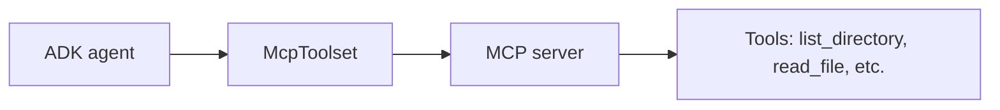

# MCP Integration

Use this reference when an ADK agent should connect to external tools through
the Model Context Protocol (MCP).

## Introduction

The Model Context Protocol (MCP) is an open standard for connecting agents to
external tools and data sources through a universal interface.

Think of it like USB for AI tools:

* one standard connection
* many compatible servers
* many compatible clients

That is the core value of MCP. Instead of writing a custom integration for
every service, you connect to an MCP server and let the protocol handle the
shape of the interaction.

Official references:

* ADK MCP docs: https://google.github.io/adk-docs/mcp/
* ADK MCP tools docs: https://google.github.io/adk-docs/tools/mcp-tools/
* MCP specification: https://modelcontextprotocol.io/

## Why MCP Matters

Before MCP, each integration usually required custom glue code.

That meant:

* separate code for each service
* framework-specific implementations
* more maintenance when APIs changed
* less portability across agent stacks

With MCP:

* a single standard works across many tools
* tool providers can maintain their own servers
* agents can reuse existing capabilities faster
* the integration surface stays consistent

In short:

* the tool owner maintains the server
* the agent connects through MCP

## Two Integration Patterns

ADK supports two MCP patterns:

1. Use an existing MCP server from your ADK agent.
2. Expose ADK tools through an MCP server.

This reference focuses on Pattern 1, where the ADK agent acts as an MCP
client and consumes tools from an external server.

## How MCP Works In ADK



The flow is:

1. The MCP server exposes tools through the MCP protocol.
2. ADK connects to the server with `McpToolset`.
3. The available tools are discovered automatically.
4. The agent can call those tools like any other ADK tool.

## The `McpToolset`

`McpToolset` is the ADK bridge to MCP servers.

It can be added directly to an agent's `tools` list.

What it does:

* connects to an MCP server
* discovers tools automatically
* proxies calls from the agent to the server
* returns the server result back to the agent

Example:

```python
from google.adk.agents import LlmAgent
from google.adk.tools.mcp_tool import McpToolset
from google.adk.tools.mcp_tool.mcp_session_manager import StdioConnectionParams
from mcp import StdioServerParameters

agent = LlmAgent(
    model="gemini-2.5-flash",
    name="my_agent",
    instruction="Use the available tools to help users.",
    tools=[
        McpToolset(
            connection_params=StdioConnectionParams(
                server_params=StdioServerParameters(
                    command="npx",
                    args=["-y", "@some/mcp-server"],
                ),
            ),
        )
    ],
)
```

Key point:

* `McpToolset` goes in `tools`
* the connection parameters tell ADK how to reach the server
* the server tools become available automatically

## Connection Types

ADK supports two main ways to connect to an MCP server.

### `StdioConnectionParams`

Use this for a local MCP server process.

```python
from google.adk.tools.mcp_tool.mcp_session_manager import StdioConnectionParams
from mcp import StdioServerParameters

connection = StdioConnectionParams(
    server_params=StdioServerParameters(
        command="npx",
        args=["-y", "@modelcontextprotocol/server-filesystem", "/path"],
    ),
)
```

Use cases:

* development
* testing
* single-user local setups

### `SseConnectionParams`

Use this for a remote MCP server over HTTP.

```python
from google.adk.tools.mcp_tool.mcp_session_manager import SseConnectionParams

connection = SseConnectionParams(
    url="https://your-mcp-server.example.com/sse",
    headers={"Authorization": "Bearer YOUR_TOKEN"},
)
```

Use cases:

* production
* hosted servers
* cloud deployments

## Tool Filtering

MCP servers can expose many tools, but you may only want a few of them.

Use `tool_filter` to restrict what the agent can access.

Why filtering matters:

* security: expose only safe tools
* simplicity: give the agent only what it needs
* focus: reduce tool noise

Example:

```python
McpToolset(
    connection_params=StdioConnectionParams(...),
    tool_filter=["list_directory", "read_file"],
)
```

For filesystem-style servers, filtering read-only tools is a good default in
production.

## How To Choose The Right Tool Approach

Use this decision rule:

* If the task is Google Search or code execution, use built-in ADK tools.
* If an MCP server already exists for the capability, use MCP tools.
* If the capability is your own business logic or proprietary system, write a
  custom function tool.

Comparison:

| Aspect | MCP tools | Built-in tools | Custom function tools |
| --- | --- | --- | --- |
| Maintained by | Community or vendor | ADK | You |
| Setup | Connect and configure | Import | Write code |
| Portability | Works across frameworks | ADK only | ADK only |
| Customization | Limited to server options | Limited | Full control |
| Time to start | Minutes | Minutes | Hours to days |

Use MCP when:

* the capability is common
* someone already built the integration
* you want portability across AI frameworks
* you prefer maintained tools over hand-built ones

Use custom function tools when:

* the logic is unique to your business
* the system is internal or proprietary
* you need full control over error handling and behavior
* there is no MCP server for the use case

## Examples Of Common MCP Servers

Common MCP server categories include:

* filesystem access
* GitHub management
* Slack messaging
* PostgreSQL or MySQL access
* Notion documents and databases
* Google Drive file access

Before writing a custom integration, check the MCP ecosystem first. The
feature you need may already exist as a server.

## Source Note

This reference is based on ADK's MCP documentation and the MCP ecosystem
design.
