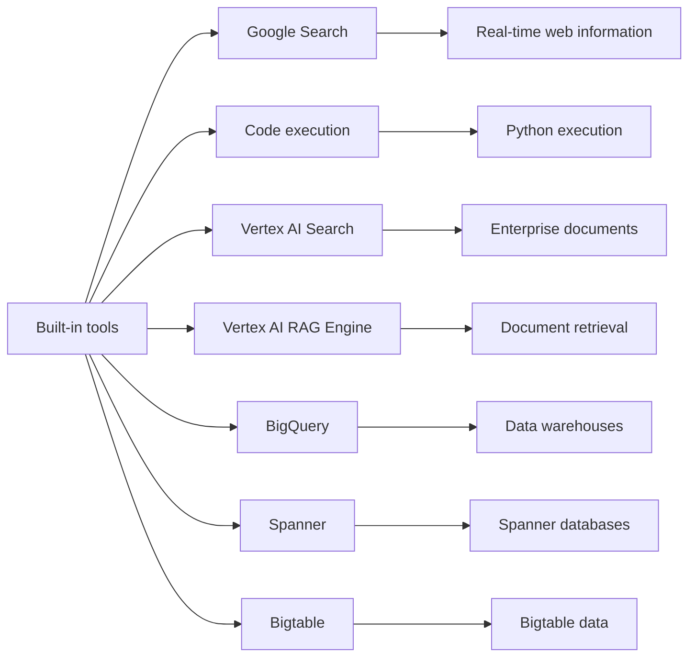

# Agent Tools

Use this reference when introducing built-in ADK tools after the basic,
custom-tool lesson.

## Introduction

From custom tools to built-in tools.

Your journey:

* Part 1: understand tools fundamentally and build your first tool-enabled
  agent.
* Part 2: use the production-ready tools that ADK already provides.

The shift is simple:

* instead of writing implementation code for every capability,
* you import and use prebuilt tools that ADK maintains.

For the official ADK overview of these tools, see:

https://google.github.io/adk-docs/tools/built-in-tools/

## The Problem

Reinventing common capabilities.

Suppose you want to add web search to the agent from Part 1:

```python
def search_web(query: str) -> dict:
    """Search the internet for information."""
    # How would this work in practice?
    # - Call a search API. Which one? How do we authenticate?
    # - Parse and format results for LLM consumption
    # - Handle rate limits and failures
    # - Keep the API integration up to date
    # - Optimize the output for the LLM
    # This gets complex fast.
    pass
```

Problems with building everything yourself:

* Implementation complexity: API integration, authentication, and error
  handling.
* Maintenance cost: API changes, updates, and deprecations.
* Not optimized: results still need to be shaped for LLM consumption.
* Missing production features: rate limiting, caching, and observability.
* Time cost: hours or days to build what should take minutes.

The root issue is that common capabilities like web search and code execution
require significant engineering effort to implement correctly.

## Built-In Tools

ADK includes ready-made tools for common production needs.

Use them when you want to:

* fetch current information
* run exact calculations
* query external systems
* perform real actions safely

In short:

* the model decides what to do,
* the tool does the actual work.

This lesson focuses on two built-in tools:

1. Google Search, which is useful for current information.
2. Code execution, which is useful for math and computation.

## Built-In Tool Overview



The blue-highlighted tools in this lesson are Google Search and code
execution.

## 1. Google Search

Google Search lets the agent search the web using Google Search.

What it offers:

* real-time web results
* current and reliable information
* automatic grounding of answers in sources
* search suggestions that must be shown in the user interface

The Google Search tool is available only with Gemini 2.0 or later models.

### How to use it

```python
from google.adk.agents import LlmAgent
from google.adk.tools import google_search

search_agent = LlmAgent(
    model="gemini-2.5-flash",
    name="search_agent",
    instruction="You help users find information using web search.",
    tools=[google_search],
)
```

### What changes from Part 1

* Import the tool instead of defining it.
* Do not write the implementation yourself.
* Use the ADK-provided integration.
* Use Gemini 2.0 or newer.

### What happens when the agent uses it

1. The agent decides that search is needed based on the user request.
2. The agent generates search queries automatically.
3. Google Search returns relevant results.
4. The agent synthesizes those results.
5. The response includes citations.

### Grounding with Google Search

Grounding connects the agent's answer to reliable sources and reduces
hallucinations.

Important policy note:

When you use Google Search grounding, you must show the rendered search
suggestions in the application UI.

That display belongs in the app layer, not in `agent.py`.

Example pattern:

```python
response = runner.run(...)
if hasattr(response, "rendered_content") and response.rendered_content:
    display_html(response.rendered_content)
```

Do not omit the rendered content when the tool returns it.

## 2. Code Execution

Code execution lets the agent run Python code safely.

What it offers:

* safe Python execution
* precise calculations
* data processing and analysis
* algorithm execution
* transformation and validation steps

### How to use it

```python
from google.adk.agents import LlmAgent
from google.adk.code_executors import BuiltInCodeExecutor

code_agent = LlmAgent(
    model="gemini-2.5-flash",
    name="code_agent",
    instruction="You help users with calculations and data processing.",
    code_executor=BuiltInCodeExecutor(),
)
```

Notice the difference:

* code execution uses `code_executor`
* it does not use the `tools` list

### What the agent can do with code execution

* perform complex math
* process and transform data
* generate visualizations
* implement algorithms
* validate calculations

### Example scenario

User: "Calculate compound interest on $10,000 at 5% annual rate for 10 years."

The agent can:

1. Recognize that the request needs precise calculation.
2. Generate Python code for the formula.
3. Run the code.
4. Return the computed result.

### Main benefits

* Precision: no approximate LLM arithmetic.
* Multi-step operations: support for more complex workflows.
* Verification: code can be inspected and checked.
* Reproducibility: the same code produces the same result.

## Built-In Tools And Session State

Built-in tools can work with session state to create more personalized and
context-aware behavior.

Examples:

* Google Search can respect user preferences such as language or location.
* Code execution results can be stored for later use.
* Search queries can be personalized with `user:` namespace values.

Example pattern:

```python
state["user:preferred_units"] = "metric"

instruction = """
When performing calculations, use {user:preferred_units?imperial} units.
Use code execution for accurate calculations.
"""
```

The full state integration story belongs in a later lesson.

## When To Use Built-In Tools

Built-in tools versus custom function tools:

| Aspect | Built-in tools | Custom function tools |
| --- | --- | --- |
| Setup | Import and use | Write the implementation |
| Maintenance | ADK maintains it | You maintain it |
| Optimization | Pre-optimized for LLMs | You optimize it |
| Customization | Limited to tool capabilities | Full control |
| Examples | Google Search, code execution | `get_capital_city`, `calculate_shipping` |
| Ideal for | Common capabilities | Business-specific logic |

Use built-in tools when you:

* need common capabilities such as search or code execution
* want production-ready, maintained solutions
* do not want to build complex integrations yourself
* need optimization for LLM interaction
* want enterprise-grade reliability

Use custom function tools when you:

* need business-specific logic
* integrate with proprietary systems
* implement unique algorithms
* need tasks that are simple and exclusive to your app
* want full control over the implementation

Example decision:

* Task: add web search to the agent.
* Decision: use `google_search`.
* Why: it is a common capability, expensive to implement, and maintained by
  ADK.

* Task: query inventory in our own database.
* Decision: create a custom function tool.
* Why: it is a proprietary system and the logic is specific to the business.

## Limitations

Some built-in tools have compatibility limits.

In particular, the ADK docs call out cases where Google Search and code
execution cannot be combined with other tools in the same agent instance.

Examples that do not work in those restricted setups:

```python
root_agent = LlmAgent(
    model="gemini-2.5-flash",
    tools=[google_search, my_custom_function],  # Not supported together.
)
```

```python
root_agent = LlmAgent(
    model="gemini-2.5-flash",
    tools=[google_search],
    code_executor=BuiltInCodeExecutor(),  # Not supported together.
)
```

The workaround for multi-tool setups is to use multiple specialized agents.
ADK also provides Python-specific search workarounds such as
`bypass_multi_tools_limit=True` for certain search tools, but that is beyond
the scope of this introductory lesson.

## Practical Example

Create two separate agents to demonstrate both built-in tools:

1. A research assistant that uses Google Search to retrieve current
   information.
2. A math assistant that uses code execution to perform calculations.

### Example 1: research assistant

```python
"""
Research assistant agent.

Demonstrates the built-in Google Search tool in ADK for real-time information
retrieval.
Reference: https://google.github.io/adk-docs/tools/built-in-tools/
"""

from google.adk.agents import LlmAgent
from google.adk.tools import google_search

root_agent = LlmAgent(
    model="gemini-2.5-flash",
    name="research_assistant",
    description="Helps users research topics using Google Search.",
    instruction="You help users find current information using web search.",
    tools=[google_search],
)
```

### Example 2: math assistant

```python
"""
Math assistant agent.

Demonstrates the built-in code execution tool in ADK for calculation and
data processing.
"""

from google.adk.agents import LlmAgent
from google.adk.code_executors import BuiltInCodeExecutor

root_agent = LlmAgent(
    model="gemini-2.5-flash",
    name="math_assistant",
    description="Helps users calculate and analyze data.",
    instruction="You help users with precise calculations and data analysis.",
    code_executor=BuiltInCodeExecutor(),
)
```

## Source Note

This reference is based on the ADK documentation for built-in tools, Google
Search grounding, code execution, and built-in tool limitations.

Official built-in tools overview:

https://google.github.io/adk-docs/tools/built-in-tools/
