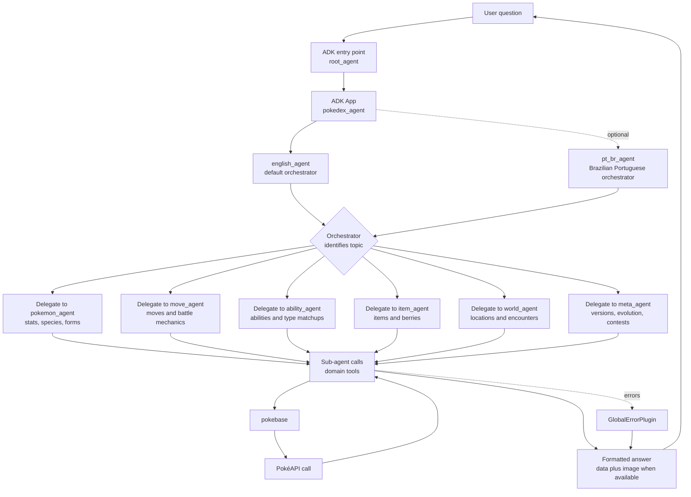

# pokedex-agent

A hands-on Pokédex-style AI agent built with Google ADK and
[PokéAPI](https://pokeapi.co/).

I created this project to learn how Google ADK works in practice: how to define
agents, connect tools, split responsibilities across specialist sub-agents, run
the project locally, and handle real API data inside an agent workflow.

If you want a guided explanation of the project before changing code, start
with [`pokedex-agent-explainer`](.agents/skills/pokedex-agent-explainer/SKILL.md).
It is written like a teacher walking through the architecture step by step.

## What it does

`pokedex-agent` answers Pokémon questions by routing each request to a specialist
ADK sub-agent. The specialists call domain tools backed by
[PokéAPI](https://pokeapi.co/) data through `pokebase`, then return a formatted
answer with images when available.

## Why it is useful

This is a small learning project for practicing real ADK patterns without a
large application around them. It demonstrates orchestration, sub-agent
delegation, tool calling, model configuration, and ADK plugin callbacks in one
focused codebase.

For a conceptual walkthrough of the package, the root agent, and the specialist
sub-agents, the explainer skill in `.agents/skills/` is the best starting point.

## ADK topics used

This repository is both a working agent and a study project. The ADK topics used are:

- [x] Root agent entry point with `root_agent`.
- [x] ADK `App` wiring.
- [x] Orchestrator agents.
- [x] Multilingual/i18n agent behavior with English and Brazilian Portuguese.
- [x] Specialist sub-agents.
- [x] Sub-agent delegation.
- [x] Function tools for PokéAPI data.
- [x] Shared model configuration.
- [x] YAML-backed root agent prompt configuration with `root_agent.yaml`.
- [x] Dynamic instruction assembly for the root orchestrators and specialist sub-agents.
- [x] Schema-grounded responses from structured tool outputs.
- [x] ADK plugin callbacks for model and tool errors.
- [x] ADK Web.
- [x] ADK CLI runs.

## Requirements

- Python 3.12+
- `uv`
- One configured model provider: Gemini, NVIDIA NIM, or local Ollama/LiteLLM

## Quick start

Install dependencies from the project root:

```sh
uv sync
```

Create a local Gemini environment file:

```sh
cp .env.example .env
```

Run the ADK web UI:

```sh
uv run adk web pokedex_agent
```

Or run one prompt from the CLI:

```sh
uv run adk run pokedex_agent "Tell me about Pikachu"
```

## Configuration

Set `MODEL_PROVIDER` to one of:

- `google`: Gemini API through ADK's documented `GOOGLE_API_KEY`.
- `nvidia`: NVIDIA NIM through `NVIDIA_NIM_API_KEY`.
- `local`: local LiteLLM/Ollama model through `LOCAL_MODEL`.

The checked-in `.env.example` is intentionally the normal ADK/Gemini profile.
Use separate ignored files such as `.env.nvidia` or `.env.ollama` for alternate
providers.

Example NVIDIA NIM config:

```env
MODEL_PROVIDER=nvidia
NVIDIA_NIM_API_KEY=REPLACE_WITH_YOUR_NVIDIA_NIM_API_KEY
NVIDIA_MODEL=nvidia_nim/deepseek-ai/deepseek-v4-flash
NVIDIA_REASONING_EFFORT=none
```

NVIDIA NIM and local LiteLLM models are supported for normal ADK Web text chat.
ADK Web's audio/video live controls require a Gemini Live model. To use live
mode, switch to `MODEL_PROVIDER=google` and optionally set `GOOGLE_LIVE_MODEL`.
For Gemini 2.5 Flash Live, use:

```env
GOOGLE_LIVE_MODEL=gemini-2.5-flash-native-audio-preview-12-2025
```

Do not paste real API keys into chat or commit them to git. Local `.env` files
are ignored by git.

## Usage

The package exposes two orchestrator agents:

- `english_agent`: answers in English by default.
- `pt_br_agent`: answers in Brazilian Portuguese.

The default `root_agent` points to `english_agent`, which can respond in
Brazilian Portuguese when the user writes in Portuguese or explicitly asks for
Portuguese. `pt_br_agent` is available when a dedicated Portuguese entry point
is preferred.

## Project structure

This project is organized as a single ADK agent package in `pokedex_agent/`.
That directory contains `agent.py`, which exports the default `root_agent`.

The prompt text for the root orchestrators and specialist sub-agents lives in
[`root_agent.yaml`](root_agent.yaml) and is assembled at runtime so the agent
instructions stay consistent across the package.

- `pokedex_agent/agent.py` wires the orchestrator agents and ADK app.
- `pokedex_agent/factory.py` contains shared agent factory helpers.
- `pokedex_agent/agent_prompts.py` loads and assembles the dynamic agent
  instructions from `root_agent.yaml`.
- `pokedex_agent/sub_agents/` contains specialist sub-agents.
- `pokedex_agent/tools/` contains [PokéAPI](https://pokeapi.co/) tool wrappers
  grouped by domain.
- [AGENTS.md](AGENTS.md) contains coding-agent instructions, project conventions, and checks.

## Agent flow

The orchestrator receives the user question, selects the best specialist
sub-agent, and that sub-agent calls the PokéAPI through its domain tools.



## Troubleshooting

If ADK returns `_ResourceExhaustedError`, the selected model has exhausted its
quota or rate limit. Wait and retry, switch to `MODEL_PROVIDER=local`, or use a
provider key/project with available quota.

If ADK returns `AuthenticationError`, check that the selected env file contains
the correct API key for the active `MODEL_PROVIDER`, then restart ADK Web.

If ADK returns `MidStreamFallbackError` with NVIDIA NIM, keep
`NVIDIA_REASONING_EFFORT=none` in the selected env file and restart ADK Web.

## Development checks

Run Ruff before finishing changes:

```sh
uv run ruff check pokedex_agent
```

Format code with:

```sh
uv run ruff format pokedex_agent
```

After changing agent wiring, imports, exports, or factories, run:

```sh
uv run python -c "import pokedex_agent.agent; from pokedex_agent.sub_agents import create_all_sub_agents; print(len(create_all_sub_agents()))"
```

## Help

This is a personal learning project. Start with [AGENTS.md](AGENTS.md) for
project conventions before changing agent prompts, tools, or wiring.

If you want the “why” before the “how,” read
[`pokedex-agent-explainer`](.agents/skills/pokedex-agent-explainer/SKILL.md)
for a guided overview of the project structure and behavior.
