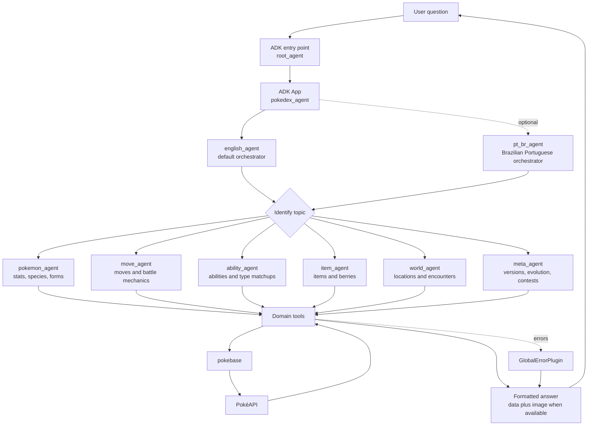

# pokedex-agent

A hands-on Pokédex-style AI agent built with Google ADK and PokéAPI.

I created this project to learn how Google ADK works in practice: how to define
agents, connect tools, split responsibilities across specialist sub-agents, run
the project locally, and handle real API data inside an agent workflow.

## Learning goals

This repository is both a working agent and a study project. The main topics
covered are:

- [x] Create a Google ADK agent package with a default `root_agent`.
- [x] Configure model selection through environment variables.
- [x] Build an ADK `App` around the root agent.
- [x] Create a language-aware orchestrator agent.
- [x] Add a Brazilian Portuguese agent variant.
- [x] Split the assistant into specialist sub-agents.
- [x] Use sub-agent delegation for different Pokémon knowledge domains.
- [x] Create reusable agent factory helpers.
- [x] Wrap external API calls as agent tools.
- [x] Organize tools by domain: Pokémon, moves, abilities, items, world, and metadata.
- [x] Use PokéAPI data through `pokebase`.
- [x] Add image URL support for Pokémon and item responses.
- [x] Add global error handling with an ADK plugin.
- [x] Run the agent through ADK Web.
- [x] Run one-shot questions through the ADK CLI.
- [x] Manage dependencies with `uv`.
- [x] Lint and format code with Ruff.
- [x] Document project conventions for future coding agents in `AGENTS.md`.

## Requirements

- Python 3.12+
- `uv`
- A Gemini API key for ADK model calls

## Language agents

The package exposes two orchestrator agents:

- `english_agent` answers in English.
- `pt_br_agent` answers in Brazilian Portuguese.

`root_agent` remains available as the default ADK entry point and points to `english_agent`.

## Project structure

This project is organized as a single ADK agent package in `pokedex_agent/`.
That directory contains `agent.py`, which exports the default `root_agent`.

- `pokedex_agent/agent.py` wires the orchestrator agents and ADK app.
- `pokedex_agent/factory.py` contains shared agent factory helpers.
- `pokedex_agent/sub_agents/` contains specialist sub-agents.
- `pokedex_agent/tools/` contains PokéAPI tool wrappers grouped by domain.
- `AGENTS.md` contains coding-agent instructions, project conventions, and checks.

## Agent flow



## Setup

Install dependencies from the project root:

```sh
uv sync
```

Copy the example environment file and add your API key:

```sh
cp .env.example .env
```

Use `MODEL_PROVIDER=google` for Gemini API calls, `MODEL_PROVIDER=nvidia` for
NVIDIA NIM, or `MODEL_PROVIDER=local` for a local LiteLLM/Ollama model.

The SDK accepts `GOOGLE_API_KEY` or `GEMINI_API_KEY`. If both are set,
`GOOGLE_API_KEY` takes precedence.

For NVIDIA NIM, use `.env.nvidia`:

```env
MODEL_PROVIDER=nvidia
NVIDIA_NIM_API_KEY=REPLACE_WITH_YOUR_NVIDIA_NIM_API_KEY
NVIDIA_MODEL=nvidia_nim/deepseek-ai/deepseek-v4-flash
```

Do not paste real API keys into chat or commit them to git. Fill the key locally
in `.env.nvidia`, which is ignored by git.

If ADK returns `_ResourceExhaustedError`, the selected model has exhausted its
quota or rate limit. Wait and retry, switch to `MODEL_PROVIDER=local`, or use a
Gemini API key/project with available quota.

## Run with ADK

Run the ADK web UI from the project root:

```sh
uv run adk web pokedex_agent
```

For a one-shot CLI run:

```sh
uv run adk run pokedex_agent "Tell me about Pikachu"
```

## Development checks

Run Ruff before finishing changes:

```sh
uv run ruff check pokedex_agent
```

Format code with:

```sh
uv run ruff format pokedex_agent
```

After changing agent wiring, imports, exports, or factories, run:

```sh
uv run python -c "import pokedex_agent.agent; from pokedex_agent.sub_agents import create_all_sub_agents; print(len(create_all_sub_agents()))"
```
